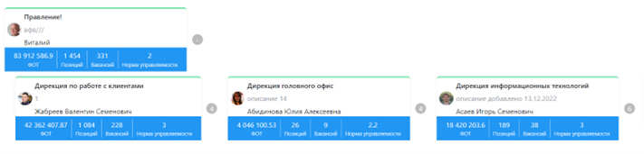

# Просмотр структуры
---
## Разные виды отображения
Пользователь в основном меню нажимает кнопку **«Структура»**.

Система отображает **оргструктуру** с визуальным отображением вида «Граф», это наиболее компактный вид, представляющий структуру в виде отдельных «деревьев», идущих от первого уровня 
Пользователь в  кнопку на значение «Органиграмма».

  

> [!WARNING]
> Система отображает оргструктуру с визуальным отображением вида **«Органиграмма»**, это наиболее наглядное и классическое представление оргструктуры, наименее компактный вид (Рисунок 4). 

Система отображает **оргструктуру** с визуальным *отображением* вида «Органиграмма», это наиболее наглядное и классическое представление оргструктуры, наименее компактный вид 
 
``Виды отображения обладают идентичной функциональностью и содержат один и тот же набор данных.``

## Разные типы структур организации
---

Типы оргструктур могут быть:

- **Административный**. Основной вид структуры. По умолчанию отображает юридическую структуру организации, включая подразделения и связи между ними, позиции, и сотрудников на позициях.

- **Альтернативные виды**. Особый вид с группировкой по выбранному набору параметров. Допускает гибкую настройку группировки через конфигуратор системы.
---

При альтернативном виде структуры система позволяет строить и отображать распределение и взаимозависимости между отдельными объектами структуры на основе произвольного набора признаков, не обязательно связанного с юридической структурой. Примерами таких типов отображения может являться управленческая структура, функциональная структура, региональное распределение сотрудников, и т.д. Настройка таких видов осуществляется администратором системы через раздел конфигуратор. Настроенные альтернативные типы отображения становятся доступны всем пользователям. При этом, ограничения, накладываемые ролью пользователя, сохраняются. Например, если руководитель подразделения А не может видеть в юридической структуре данные о денежном вознаграждении сотрудников подразделения Б, то и в альтернативных видах отображения такие данные ему будут недоступны.
Для переключения между структурами пользователь нажимает на выпадающий список «Типы структур».
