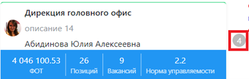

# Просмотр структуры с детализацией на разных уровнях 2 варианта
---
## Вариант 1 (массовое действие)

Пользователь нажимает на кнопку   для быстрого раскрытия или закрытия всех структурных единиц на текущем экране пользователя до определенного уровня. При нажатии на кнопкку система отображает к выбору значения(Рисунок 6):
- **«Подразделения»** при этом система раскрывает структуру до уровня подразделения
- **«Расписание»** при этом система раскрывает структуру до уровня подразделений с развернутым штатным расписанием для каждого из них;
- **«Люди»** при этом система раскрывает структуру до списка сотрудников каждого подразделения.

  

## Вариант 2 (индивидуальное)

Для быстрого раскрытия одной структурной единицы на текущем экране пользователя, Пользователь нажимает на серую кнопку с цифрой `обозначающей количество подчиненных элементов` около элемента оргструктуры

  

При этом, отображаются все подчиненные элементы, раскрываемому элементу.
 
 Для быстрого сворачивания структурной единицы, Пользователь нажимает на серую кнопку с прочерком  , система скрывает подчиненные элементы.

Для просмотра структуры элемента с развернутым штатным расписанием, Пользователь нажимает на наименование элемента.

  

Для просмотра структуры элемента до списка сотрудников, Пользователь нажимает на строку штатного расписания 

  

