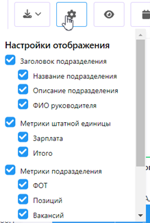

# Выбор метрик для отображения
---
Пользователь нажимает на кнопку  , система отображает список метрик (`настройка списка производится через конфигуратор системы`), в котором Пользователь отмечает чек-боксами метрики , значения которых требуется отображать в оргструктуре

  

Система отображает значение выбранных метрик на всех элементах оргструктуры.