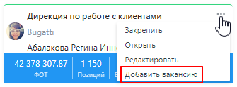
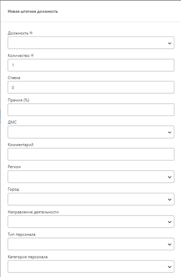

# Добавление вакансии
---
Пользователь в оргструктуре нажимает на три точки около названия подразделения, которому требуется добавить вакансию, система открывает кнопки выбора действий, Пользователь нажимает кнопку «Добавить вакансию» 

  

Система открывает форму создания вакансии 

  

>[!IMPORTANT]
>Состав полей различается для каждого заказчика в зависимости от требований.
После того как Пользователь внес все необходимые изменения, он нажимает кнопку «Сохранить», новая вакансия добавляется в подразделение.
