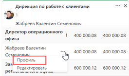

# Просмотр профиля сотрудинка
---
Для того чтобы открыть профиль сотрудника, Пользователь  при просмотре оргструктуры, раскрытой до уровня списка сотрудников, нажимает на три точки справа от ФИО сотрудника и нажимает значение «Профиль»

  

Система открывает окно со сводной информацией о сотруднике. `Профиль аккумулирует всю информацию из всех модулей системы, относящуюся к этому сотруднику`. Данные, содержащиеся в профиле сотрудника, неизменны независимо от того, из какого модуля была вызвана информация о сотруднике.
Профиль сотрудника содержит: 
- Информацию о сотруднике, позволяющую идентифицировать его как уникальный объект – ФИО и табельный номер. 
- Информацию о его положении в структуре подразделений компании. 
Занимаемую сотрудником должность. 
-	ФИО руководителя сотрудника по административному подчинению. 
-	Записи, созданные дополнительными модулями системы (участие в командах, назначенные KPI и др.). 
-	Актуальные метрики сотрудника, включая изображение-аватар. 
-	Метрики, добавленные на этапе внедрения.
-	История изменений сотрудника. 
-	Возможность просмотреть профиль сотрудника на выбранную дату в прошлом.

 Состав и внешний вид метрик в профиле сотрудника может быть настроен в конфигураторе приложения. Видимость метрик определяется правами пользователя, просматривающего профиль.

